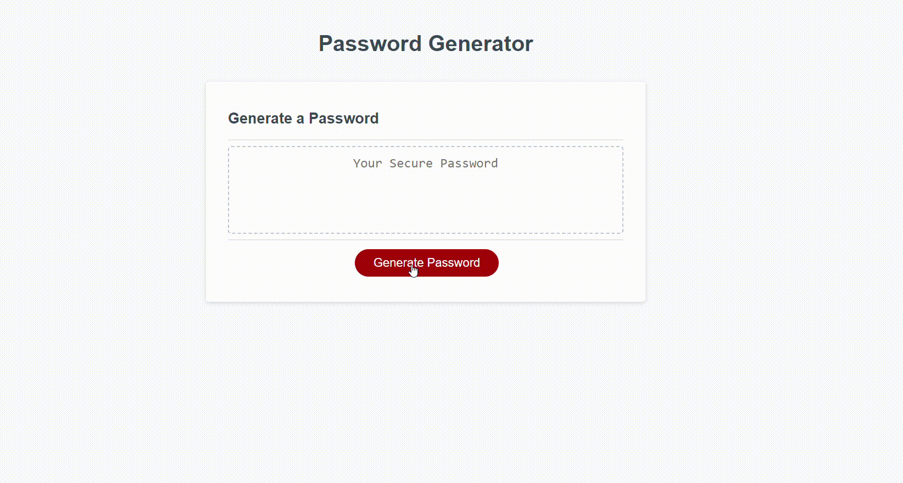

# Ap_PassCode_Generator_Shield

## Description 
This project based on to the  random password  generator implemented in javascript.  This project allows users to  select different kind of criteria ( password Length,  Uppercase, Lower Case, Special Character ,Numeric ) if they want to included it for generating a secure password.  In this project, we have a starter code , just we need to add and modify the javascript code to the complete our challenges.  In this project challenges ,i learned a user input and validation, Javascript functions, How to generate random number using for loop method and event handling. Also , learned a  conditional statement so we can check the validity of user input and handle the different aspect accordingly.  

## Table of Contents

- [Ap\_PassCode\_Generator\_Shield](#ap_passcode_generator_shield)
  - [Description](#description)
  - [Table of Contents](#table-of-contents)
  - [Installation](#installation)
  - [Usage](#usage)
  - [Credits](#credits)
  - [License](#license)

## Installation

   For doing this challenges , first i install the VS Code developer tool to edit and modify the starter code.Also, i use google chrome web browser to preview a my file.

## Usage
* Html and css starter code are available in gitlab. Clone the starter code from git lab remote repository to local computer.
start by opening the index.html file in a web browser using the vs code editor. you can check the Html elements and structures.
* Then, created a Repository on your github account.Link your github repository to your local computer using command line . 
* Modify the Javascript file based on Acceptance criteria requirements. Add a Comments on  Html,CSS  and javascript file for explain the code,so it will help the edit the source code later.After , complete the modification the code , open the index.html file on your browser.
* On the Webpage, you can see a "Generate Password Button" and input field where generated password is displayed. Now, you click the "Generate Password" Button. 
* A Prompt will appear and you can enter the desired  length of the password. In this project , enter a number between 8 to 128 and click "ok" to be continue. 
* Next , the confirmation prompts will appear , select character types you want to include into your password. the user is allowed to say “Ok” Or "Cancel"  To any given character type. However, at least one character type should be selected. 
  * Now, generated password will be displayed in the input field  of Generate a password webpage.
  * Here is the demo of  the project: 

## Credits
* i clone a starter code from this repository: [https://github.com/coding-boot-camp/friendly-parakeet.git]

* i watched this video for push the code from vs code to git hub and deployed at live .[https://www.youtube.com/watch?v=Ky_aUrzArt4]

* i learned a how to use conditional statements using this site:[https://developer.mozilla.org/en-US/docs/Learn/JavaScript/Building_blocks/conditionals]  
  
* In this project, i leaned a how to generate a random password  using this site: [https://www.w3schools.com/js/js_random.asp]

## License
N/A